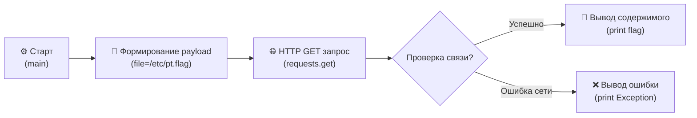

# Web-2-1 Autocomplete Script

## ⚙️ Техническое описание и стек

Скрипт разработан для автоматического получения флага стенда **Web-2-1** в категории **BootCamp** на ИБ-полигоне **Standoff 365 Hackbase**

### 🧰 Инструменты и библиотеки
* **Язык**: Python
* **Пакеты**:
  * `Requests` — работа с вэб-запросами.

### 🔄 Процесс работы скрипта



### 🚀 Запуск скрипта

1. **Установите зависимости**:
   ```bash
   pip install requests
   ```
2. **Запустите скрипт**:
   ```bash
   python Web-2-1-autocomplete.py
   ```
