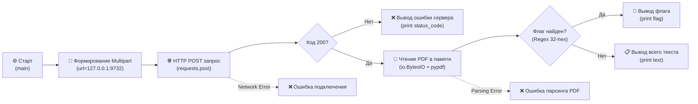

# Web-3-1 SSRF Exploit Script

## ⚙️ Техническое описание и стек

Скрипт разработан для автоматизации эксплуатации уязвимости SSRF (Server-Side Request Forgery) в категории **BootCamp** на ИБ-полигоне **Standoff 365 Hackbase**. Он заставляет внешний конвертер запросить данные с закрытого внутреннего сервиса, после чего извлекает флаг из полученного PDF-документа.

### 🧰 Инструменты и библиотеки
* **Язык**: Python
* **Пакеты**:
  * `requests` — работа с веб-запросами.
  * `pypdf` — извлечение текста из бинарного PDF-файла в памяти.
  * `re` (встроенный) — поиск флага по регулярному выражению.

---

## 📊 Процесс работы скрипта



---

## 🚀 Запуск скрипта

1. **Установите зависимости**:
   ```bash
   pip install requests pypdf
   ```
2. **Запустите скрипт**:
   ```bash
   python Web-3-1-autocomplete.py
   ```
