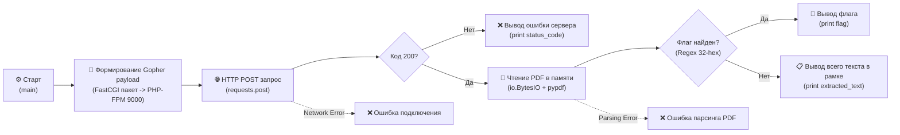

# Web-3-2 SSRF to RCE (FastCGI/Gopher) Exploit Script

## ⚙️ Техническое описание и стек

Скрипт разработан для автоматизации эксплуатации уязвимости **RCE** через **SSRF** в категории **BootCamp** на ИБ-полигоне **Standoff 365 Hackbase**. Атака использует протокол `gopher://` для взаимодействия с локальным сервисом PHP-FPM (порт 9000). Путем отправки бинарного FastCGI-пакета изменяются конфигурационные параметры PHP и выполняется системная команда `/home/rceflag`. Результат выполнения извлекается из сгенерированного сервером PDF-документа.

### 🧰 Инструменты и библиотеки
* **Язык**: Python
* **Пакеты**:
  * `requests` — работа с веб-запросами.
  * `pypdf` — чтение и парсинг бинарного PDF-файла из памяти устройства.
  * `re` (встроенный) — поиск 32-значного MD5-подобного флага в тексте.

---

## 📊 Процесс работы скрипта



---

## 🚀 Запуск скрипта

1. **Установите зависимости**:
   ```bash
   pip install requests pypdf
   ```
2. **Запустите скрипт**:
   ```bash
   python Web-3-2-autocomplete.py
   ```
